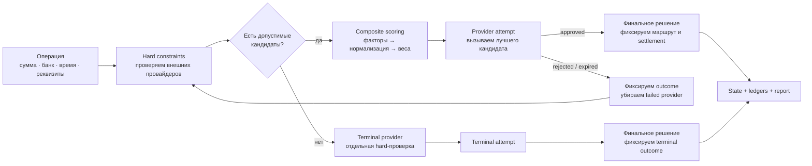
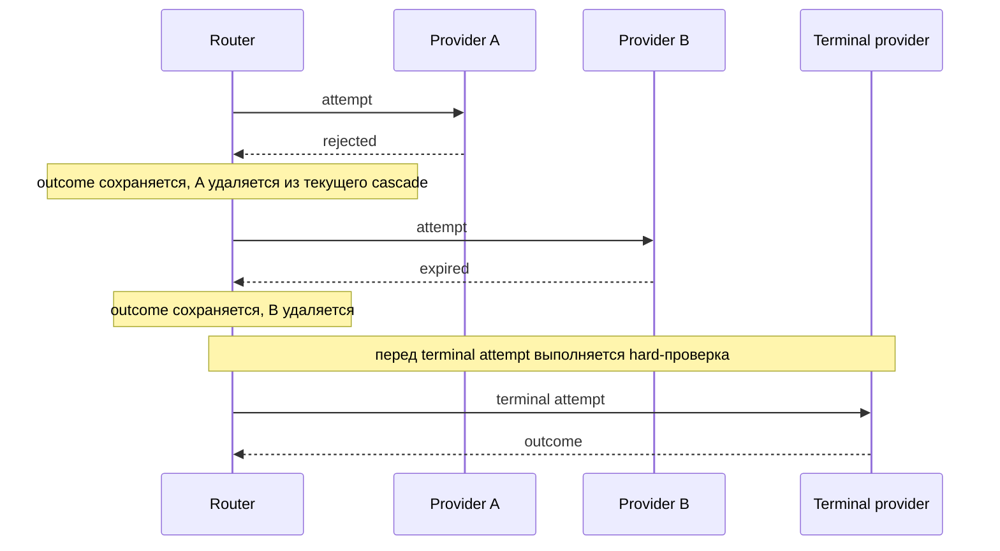
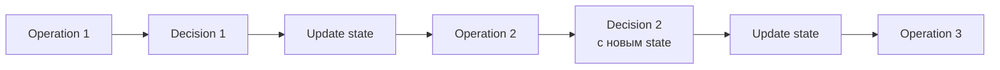
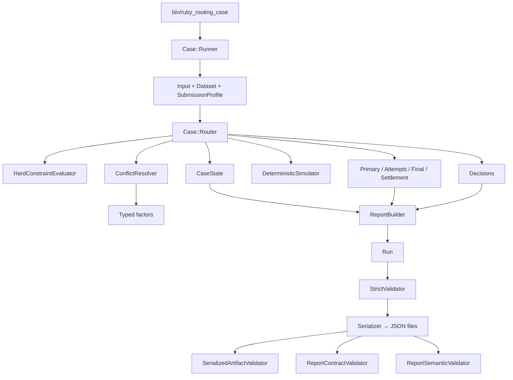

# RubyRouting

**RubyRouting** — детерминированная система интеллектуальной маршрутизации выплат на Ruby. Она принимает очередь операций и снимок состояния платёжных провайдеров, исключает недопустимые маршруты, выбирает лучший из доступных по настраиваемому набору бизнес-факторов, выполняет fallback при неуспешной попытке и формирует проверяемые решения вместе с итоговой аналитикой.

Ключевые свойства:

- **CRuby 4.0.6**;
- версия автономного `Case`-pipeline: **0.4.4**;
- hard constraints всегда применяются **до** бизнес-скоринга;
- выбор среди допустимых провайдеров выполняет один `ConflictResolver`;
- fallback использует тот же механизм выбора;
- скоринг и доли считаются точной арифметикой (`Integer` / `Rational`), без промежуточного `Float`;
- одинаковые входные файлы, профиль и simulation seed дают воспроизводимый результат;
- причины исключения, выбора, попыток и fallback сохраняются для последующего объяснения и анализа.

## Быстрый старт

Требования:

- CRuby **4.0.6**;
- Bundler.

```bash
bundle install
bundle exec ruby -Ilib bin/ruby_routing_case
```

По умолчанию CLI использует:

```text
data/providers.json
data/operations_history.csv
data/operations_queue_10.json
data/submission_profile.json
```

и создаёт в текущем каталоге:

```text
routing_decisions.json
routing_report.json
```

Запуск со своими файлами:

```bash
bundle exec ruby -Ilib bin/ruby_routing_case \
  --providers path/to/providers.json \
  --history path/to/operations_history.csv \
  --queue path/to/operations_queue.json \
  --profile path/to/routing_profile.json \
  --decisions path/to/routing_decisions.json \
  --report path/to/routing_report.json
```

`Case::Runner` строит полный результат в памяти. Затем CLI `bin/ruby_routing_case` отдельно выполняет строгую проверку `Run`, сериализует JSON и проверяет уже записанные артефакты contract- и semantic-валидаторами. При нарушении входного или выходного контракта процесс завершается с ошибкой.

## Как принимается решение

Для каждой выплаты система отвечает на два принципиально разных вопроса:

1. **Можно ли отправить операцию этому провайдеру?**
2. **Если допустимых провайдеров несколько — какой из них сейчас лучше выбрать?**

Первый вопрос решают hard constraints. Второй — multi-objective scoring. Высокий score никогда не может компенсировать нарушение обязательного ограничения.



Terminal provider — не способ обойти ограничения. Перед terminal attempt он также проходит `HardConstraintEvaluator`; если резервный маршрут недопустим, pipeline завершается fail-closed.

## 1. Hard constraints

`HardConstraintEvaluator` последовательно проверяет обязательные условия. Первое нарушенное условие становится причиной исключения провайдера.

| Проверка | Что контролируется |
|---|---|
| Статус | Провайдер должен иметь статус `active` |
| Минимальная сумма | `amount >= limit_amount_min` |
| Максимальная сумма | `amount <= limit_amount_max` |
| Дневной лимит | `daily_approved_amount + amount` не превышает `daily_amount_limit` |
| In-progress count | Baseline + transient количество операций не превышает лимит |
| In-progress amount | Baseline + transient сумма не превышает лимит |
| Банки | Поддерживаются whitelist и blacklist через `banks` / `exclude_banks` |
| Маржинальность | Отрицательная маржа допустима только при `allow_negative_agreement` |
| Реквизиты | `available_requisites` должен быть больше нуля |
| RPM | При настроенном лимите контролируется rolling-окно запросов |

Hard constraints повторно проверяются на fallback-проходах. Провайдер, который был допустим в начале cascade, не получает права автоматически пройти следующий проход, если состояние уже изменилось.

## 2. Multi-objective scoring

После hard-фильтра `ConflictResolver` получает только допустимых кандидатов.

Движок поддерживает восемь типизированных факторов:

| Фактор | Смысл |
|---|---|
| `count` | Как назначение изменит отклонение распределения количества операций от целевых долей |
| `volume` | Как назначение изменит отклонение денежного объёма от целевых долей |
| `priority` | Явный бизнес-приоритет; меньшее числовое значение означает более высокий приоритет |
| `amount` | Насколько сумма операции соответствует предпочтительному диапазону провайдера |
| `conversion_24h` | Конверсия за 24 часа из текущего provider snapshot |
| `load` | Запас доступной ёмкости по настроенным daily / in-progress лимитам |
| `intensity` | Запас относительно настроенного RPM |
| `turnover_min` | Срочность выполнения настроенного минимального оборота |

Для каждого фактора сохраняются `raw`, `normalized`, `weight`, `contribution` и текстовая причина. Итоговый score концептуально равен:

```text
score(provider) =
    Σ normalized_factor(provider) × configured_weight(factor)
```

Для `count` и `volume` используется post-decision portfolio objective: оценивается не только дефицит отдельного провайдера, а L1-отклонение **всего портфеля** после гипотетического назначения текущей операции.

Нулевой вес не даёт фактору причинного вклада в итоговый score. Отсутствующие optional-сигналы не трактуются как скрытое преимущество. Если итоговые composite scores равны, применяется детерминированный tie-break по `provider_id`; `priority` не возвращается в tie-break неявно.

### Стандартный профиль репозитория

`data/submission_profile.json` сейчас включает шесть факторов:

```json
{
  "weights": {
    "count": 2,
    "volume": 2,
    "priority": 1,
    "amount": 1,
    "conversion_24h": 2,
    "load": 1
  }
}
```

`intensity` и `turnover_min` реализованы в движке и могут быть включены конфигурацией, но в стандартном профиле активного веса не имеют.

## 3. Fallback и terminal provider

Выбор кандидата и фактический результат провайдера — разные события.



Для каждого внешнего кандидата `Router`:

1. резервирует transient capacity;
2. вызывает simulator/provider boundary;
3. освобождает transient reservation;
4. фиксирует outcome в provider state и attempt ledger;
5. при `approved` записывает финальный маршрут и settlement;
6. при `rejected` / `expired` исключает этого кандидата из текущего cascade и снова вычисляет возможность/предпочтение для оставшихся.

Fallback использует тот же `ConflictResolver`, что и первичный выбор. Второго скрытого алгоритма маршрутизации нет.

Terminal provider задаётся явно в профиле и исключён из обычного scoring pool. Его outcome также может быть `approved`, `rejected` или `expired`; settlement записывается только для `approved`.

## 4. Состояние между операциями

`ProviderCaseState` меняется по мере обработки очереди, поэтому следующая операция видит результат предыдущих попыток.

Состояние включает:

- `daily_approved_amount`;
- baseline и transient `in_progress_count`;
- baseline и transient `in_progress_amount`;
- `available_requisites`;
- rolling RPM events;
- `routed / approved / rejected / expired` counters;
- накопленный routed volume.

Дневная граница определяется `BusinessCalendar`. Он берёт UTC offset из `snapshot_at` provider snapshot и не зависит от локальной timezone процесса или внешней timezone database.



## 5. Раздельные ledgers

RubyRouting намеренно не сводит жизненный цикл выплаты к одному полю `provider_id`.

Хранятся отдельные представления:

- **primary assignment ledger** — первый выбранный провайдер в cascade;
- **attempt ledger** — все реально выполненные попытки и их outcomes;
- **final selection / traffic ledger** — один финальный выбранный provider на операцию после завершения cascade;
- **settlement ledger** — только успешные `approved` settlement-события.

Например:

```text
Primary assignment: Provider A

Attempts:
  1. Provider A -> rejected
  2. Provider B -> approved

Final selection: Provider B
Settlement:      Provider B
```

Эти populations используются отдельно и в аналитике, поэтому первая попытка, финальный маршрут и успешный settlement не смешиваются.

## 6. Explainability и аналитика

CLI формирует два основных JSON-артефакта:

- `routing_decisions.json` — компактные решения по операциям;
- `routing_report.json` — агрегированная аналитика и расширенные explanations.

Report содержит, в частности:

- outcomes всех attempts и отдельные final outcomes;
- primary assignment distribution;
- attempt distribution;
- final selection distribution;
- settlement distribution;
- count/volume shares и отклонения от targets;
- fallback count;
- причины hard exclusions;
- provider state и utilization;
- historical calibration/trend analytics;
- причинные explanations по операциям;
- диагностику недостижимости целевого распределения;
- рекомендации и структурированные `recommendation_details`.

Расширенный trace позволяет восстановить цепочку:

```text
hard exclusions
      ↓
eligible candidates
      ↓
factor values + weighted contributions
      ↓
selection reason
      ↓
provider outcome
      ↓
fallback continuation
      ↓
final provider / settlement
```

История (`operations_history.csv`) используется как отдельный аналитический источник и не считается истиной текущей eligibility.

Точные `Rational`-значения не сериализуются через `Float`: serializer сохраняет их как целое число или строку `numerator/denominator`.

## 7. Детерминированный simulator

Автономный `Case`-pipeline не отправляет реальные выплаты. Для воспроизводимых запусков используется `DeterministicSimulator`.

Доступны два режима:

- `approved` — каждая попытка без явного override завершается `approved`;
- `conversion` — outcome детерминированно выводится из seed, `operation_id`, `provider_id`, номера попытки и `conversion_24h`.

В режиме `conversion` SHA-256 формирует стабильный bucket. Поэтому одинаковый dataset + profile + seed дают одинаковую последовательность simulated outcomes без глобального random state.

Десятичные значения из JSON читаются с `decimal_class: Rational`, поэтому конверсия, маржинальность и другие ratio-поля не проходят через lossy `Float` на входной границе.

## Архитектура `Case`-pipeline



`Case` — автономный file-driven слой. Помимо него в репозитории есть основная plain-Ruby библиотека с разделением на domain, routing, application, state, ports и projections. Provider I/O отделён от deterministic routing logic и mutable coordination.

Основные каталоги:

```text
lib/
  ruby_routing/
    domain/        # immutable domain values и финансовые инварианты
    routing/       # eligibility, allocation, recovery, decision engine
    application/   # orchestration и application services
    state/         # state coordination, facts, replay/recovery
    ports/         # provider boundary
    projections/   # analytics, replay, explanations
    case/          # file-driven routing, scoring, fallback, reports, validators

bin/               # CLI и исполняемые сценарии
data/              # provider snapshot, history, queue и routing profile
test/              # unit/scenario/property/model/concurrency/case tests
benchmark/         # bounded performance/degradation measurements
docs/              # архитектурная и инженерная документация
```

## Формат входных данных

### Provider snapshot

Пример: `data/providers.json`.

Каждая provider-запись должна содержать поля:

```text
payment_system
status
traffic_percentage
priority
limit_amount_min / limit_amount_max
daily_amount_limit / daily_approved_amount
in_progress_count_limit / in_progress_count
in_progress_amount_limit / in_progress_amount
available_requisites
conversion_24h
avg_latency_sec
banks / exclude_banks
provider_margin_pct / merchant_margin_pct
allow_negative_agreement
```

Все перечисленные ключи обязательны по входной схеме. Поля лимитов, для которых отсутствие лимита имеет смысл, могут принимать `null`; неизвестные ключи отклоняются. Дополнительно разрешено поле `note`.

Корневой provider snapshot содержит также `snapshot_at`, `gateway`, `merchant` и массив `providers`.

### Queue

Пример: `data/operations_queue_10.json`.

Очередь — JSON-массив операций, отсортированных по неубывающему `created_at`. Каждая операция содержит:

```json
{
  "operation_id": "op_101",
  "created_at": "2026-07-30T09:05:00+03:00",
  "amount": 15000,
  "bank": "sberbank",
  "card_brand": null,
  "payout_requisite": {
    "sbp": {
      "phone": "79001234567",
      "bank_name": "Сбербанк"
    }
  }
}
```

`amount` должен быть положительным целым числом, `payout_requisite` — непустым объектом.

### Routing profile

Стандартный профиль находится в `data/submission_profile.json`. Он задаёт:

- provenance (`profile_id`, `source`, `revision`);
- источники count/volume targets;
- веса факторов;
- preferred amount ranges;
- simulation mode и seed;
- terminal provider;
- при необходимости RPM limits, minimum turnovers и другие policy-параметры.

Конфигурация валидируется строго: неизвестные поля/provider IDs, отрицательные веса, некорректные target maps и противоречивые policy settings приводят к явной ошибке.

## Проверка качества

Полный набор тестов:

```bash
bundle exec rake test
```

Отдельные специализированные наборы можно запускать независимо:

```bash
bundle exec rake property
bundle exec rake model
bundle exec rake concurrency
bundle exec rake fault
bundle exec rake case
```

Performance и degradation checks:

```bash
bundle exec rake benchmark
bundle exec rake load_10k
bundle exec rake degradation_metrics
bundle exec rake history_profile
bundle exec rake read_path_profile
```

CI запускает тестовые наборы, валидирует воспроизводимость file-driven артефактов, выполняет независимые проверки и запускает bounded performance/demo evidence.

## Инженерные инварианты

В реализации защищены следующие свойства:

- hard constraints абсолютны и не компенсируются soft score;
- выбор среди eligible candidates принадлежит одному `ConflictResolver`;
- fallback повторно использует тот же resolver;
- terminal provider задан явно и проходит отдельную hard-проверку;
- только явно настроенные business factors могут влиять на preference;
- zero-weight factors не влияют на итоговый score и tie-break косвенно;
- score ties разрешаются детерминированно по provider ID;
- count/volume оценивают post-decision portfolio loss;
- exact arithmetic используется для ratios, долей и score contributions;
- primary assignment, attempt, outcome, final selection и settlement остаются разными фактами;
- входы валидируются fail-closed;
- записанные JSON-артефакты проходят отдельную contract/semantic validation;
- одинаковые входные данные и конфигурация дают воспроизводимый результат.

## Куда смотреть в коде

Для быстрого понимания основного routing path:

1. `lib/ruby_routing/case/runner.rb` — загрузка данных, сборка Router и Report.
2. `lib/ruby_routing/case/state.rb` — hard constraints и mutable provider state.
3. `lib/ruby_routing/case/traffic.rb` — target/assignment ledgers и post-decision portfolio loss.
4. `lib/ruby_routing/case/factors.rb` — факторы, веса, normalization и `ConflictResolver`.
5. `lib/ruby_routing/case/router.rb` — routing, provider attempts и fallback cascade.
6. `lib/ruby_routing/case/report.rb` — analytics, explanations и recommendations.
7. `lib/ruby_routing/case/validator.rb` и `lib/ruby_routing/case/semantic_validator.rb` — независимые проверки выходных данных.

Текущая архитектурная сводка: `docs/CURRENT_ARCHITECTURE.md`.
